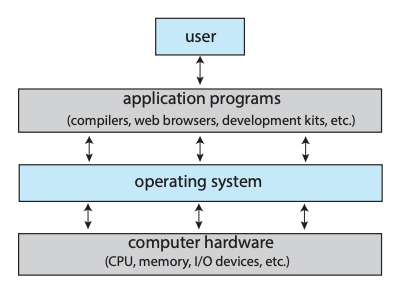
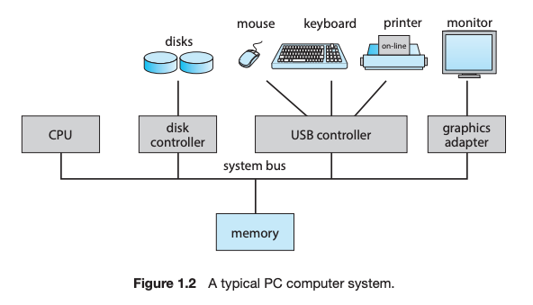
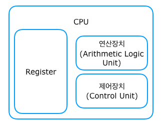

# 1주차 스터디 정리

## 컴퓨터 시스템 구조
### 컴퓨터 시스템 요소
- user 
- hardware(CPU, Memory, I/O devices, etc)
- application programs(compilers, web browsers, development kits, etc)
- OS(Operating System)
  - 컴퓨터의 하드웨어를 관리하고, 하드웨어와 소프트웨어, 사용자를 매개하는 프로그램
  - OS의 핵심은 **커널(Kernel)**! 따라서, 보통 OS와 커널은 동일시된다. 
  - (User View) 사용자가 컴퓨터를 쉽게 사용할 수 있도록 하는 인터페이스 역할! 
  - (System View) 자원 할당자(Resource Allocator)
  - (System View) 컴퓨터 자원들을 관리하는 제어 프로그램(Control Program)

 

### 컴퓨터 시스템 구조 자세히 살펴보기

**CPU**
- 중앙 처리 장치(Central Processing Unit)
  - 외부에서 정보를 입력받고, 기억하고, 컴퓨터 프로그램의 명령어를 해석하여 연산하고, 외부로 출력하는 역할
  - 컴퓨터 부품과 정보를 교환하면서 컴퓨터 시스템 전체를 제어하는 장치로, 모든 컴퓨터의 작동과정이 CPU의 제어를 받는다. 
  - 연산을 수행하는 산술논리장치(ALU), 제어 명령을 전달하는 컨트롤 장치(CU), 결과 값을 일시적으로 기억하는 레지스터(Register)로 구성된다. 
  
 

**메모리(Memory)**
  - CPU의 Register의 용량은 매우 작다. 그래서 정보를 저장해 두었다가 필요할 때 읽어 들여 이용할 수 있는 **주기억 장치**가 필요하다. 이 주기억장치에는 컴퓨터가 켜지면 운영체제, 사용자 프로그램 등이 메모리공간에 올라가게된다. CPU는 주기억장치에서 프로그램들의 명령어등을 읽어와 작업을 수행한다. 주 기억창치로는 ROM, **RAM** 등이 있음.
 

https://wan-blog.tistory.com/32

## 퀴즈
1. A **program** is defined as a set of instructions that directs a computer to perform a certain
job to do.  

2. A **kernel** is the core of operating system that is running at all times on the computer.

3. A **bootstrap program** is the first program to run on computer power-on, and then loads
the operating system into the main memory.

4. **Virtualization** is a technology that allow us to abstract the hardware of a single computer
into several different execution environments to enable for several OSes to run
concurrently. 

5. A **system call** provides an interface to the services made available by the operating