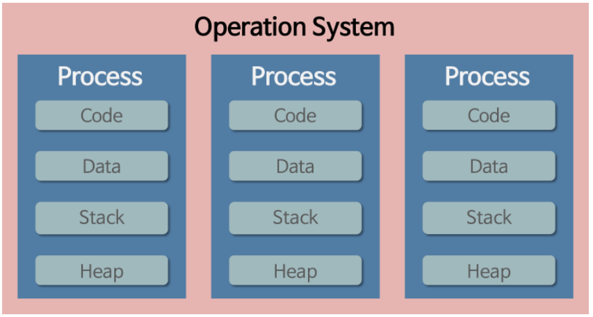
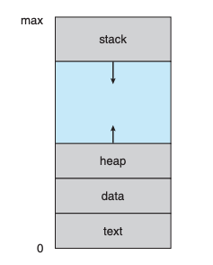
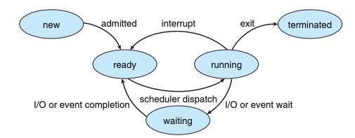
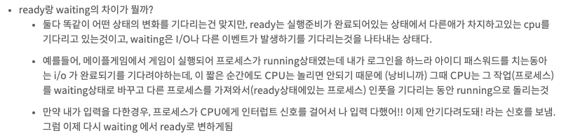
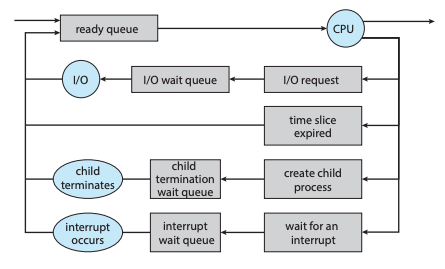
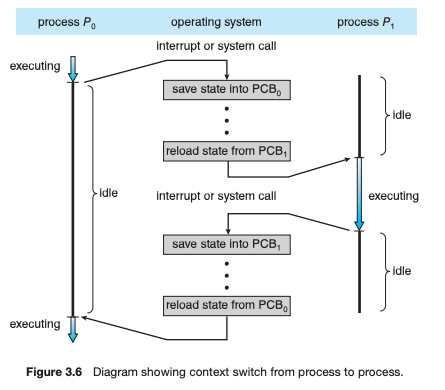

# 2주차 스터디 정리

## 프로세스(Process)란?
- 실행 중인 프로그램(A program in execution)
- OS 작업의 단위(the unit of work)
- 디스크에 있는 것은 프로그램, 메모리에 로드된 것은 프로세스
- 프로세스는 각 메모리 공간을 시스템으로부터 할당받는다

## 프로세스의 메모리 구조
- Text section : 실행할 프로그램의 코드(the executable code)
- Data section : 전역변수(global variables), 프로그램이 시작할 때 할당되어 프로그램 종료 시 소멸됨.
- Heap section : 동적 메모리 할당 영역
- Stack section : temporary data storage when invoking functions. (function parameters, return addresses, local variables)

## 프로세스의 상태(Process State)
- New : 프로세스가 처음 생성되었을 때
- Running : 프로세스가 할당되어 실행될 때
- Waiting : 프로세스가 이벤트를 기다릴 때
- Ready : 프로세스가 프로세서에 할당되기를 기다릴 때
- Terminated : 프로세스가 실행을 마쳤을 때

## Process Control Block(PCB)
- 각각의 프로세스는 자신의 정보 묶음인 **PCB**를 가지고 있다. 
- 운영체제 커널의 자료구조(운영체제 입장에서 프로세스를 표현한 것이 PCB라 이해하자!)

- Process state: 프로세스의 상태.
- Program counter: 해당 프로세스가 이어서 실행해야 할 명령의 주소를 가리키는 카운터.
- CPU registers: 프로세스가 인터럽트 이후 올바르게 작업을 이어가기 위해 참조하는 CPU 레지스터 값.
- CPU-scheduling information: 프로세스의 중요도, 스케줄링 큐 포인터 등 스케줄링 파라미터 정보.
- Memory-management information: base, limit 레지스터 값, 페이지 테이블 등 메모리 시스템 정보.
- Accounting information: 사용된 CPU 총량, 프로세스 개수, 시간 제한 등.
- I/O status information: 프로세스에 할당된 입출력 장치 목록, 열린 파일 목록 등.

## Process Scheduling
- 멀티프로그래밍의 목적은 **CPU를 최대로 사용하기 위해** 항상 일부 프로세스를 실행하는 것이다. 
- Time Sharing의 목적은 프로세스 간에 CPU를 자주 전환함으로써 사용자가 각 프로그램이 실행되는 동안 서로 상호작용할 수 있도록 만드는 것이다. 
- 이러한 목적을 달성하기 위해 **프로세스 스케줄러**는 CPU에서의 프로그램을 실행을 위해 사용 가능한 프로세스를 선택하며, 어떤 프로세스를 프로세서에 할당할 것인가 결정하는 일을 **프로세스 스케줄링**이라고 한다.
 

### Scheduling Queues

## Context Switch
- 프로세스가 실행되다가 인터럽트가 발생해 운영체제가 개입하여 프로세서에 할당된 프로세스를 바꾸는 것을 말한다. 
- 시스템 콜을 사용해야 하는 경우 프로세스가 자체적으로 처리할 수 없기 때문에 운영체제가 개입해야 한다. 
- 프로세서가 다른 프로세스로 스위치할 때, 시스템은 작업중이던 프로세스의 상태를 저장하고 새로운 프로세스의 상태를 로드한다. 
- 컴퓨터과학에서 컨텍스트는 내 시스템에서 활용 가능한 모니터링된 정보들을 의미한다. 
- 프로세서 입장에서 **Context는 PCB**이기 때문에 **PCB 정보가 바뀌는 것**을 **Context Switch**라고 부른다. 
- 컨텍스트 스위치는 오버헤드가 발생하는 작업이기 때문에 너무 자주 일어나면 성능을 저하한다.

## Operations on Processes
- 대부분의 시스템에서 프로세스는 동시에 실행될 수 있고, 이들은 동적으로 생성되거나 삭제될 수 있다. 
- 시스템은 프로세스 생성, 삭제 메커니즘을 제공해야 한다.

### Process Creation

### Process Termination 

## 질문!
- 컨텍스트 스위칭에 대해 설명해보세요.
- 프로세스 관련 용어를 설명해보세요. (알아만 둡시다.)
  - PCB: 프로세스 제어 블록, 프로세스에 대한 중요한 정보를 저장합니다.
  - PC: 프로그램 카운터, 프로세스 실행을 위한 다음 명령의 주소를 표시합니다.
  - 캐시메모리: 자주 사용되는 데이터가 저장되는 공간으로 CPU의 레지스터와 메모리 사이에서 병목 현상을 완화하는 장치입니다.

