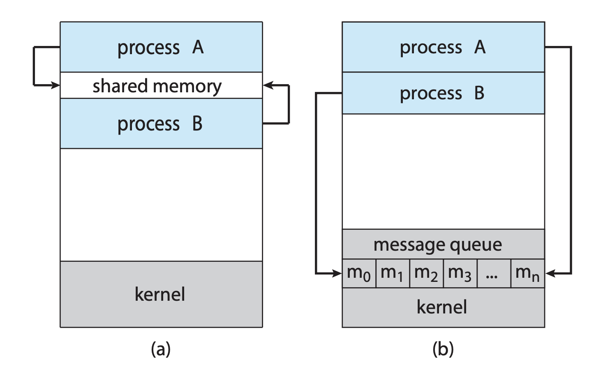

# 3주차 스터디 정리

## Interprocess Communication(IPC)
프로세스는 독립적으로 동작하거나 서로 협력하며 동작할 수 있다. 협력하는 프로세스들은 통신하며 서로에게 영향을 미친다.   
IPC 모델에는 **공유 메모리(Shared memory)** 와 **메시지 패싱(Message passing)** 이 있다.

  

### Producer-Consumer Problem 
A producer produces information that is consumed by a consumer.
- a compiler produces assembly code, and a assembler consumes it.
- a web server produces an HTML file, and a browser consumes it.
  

### IPC in Shared Memory Systems
- 특정 메모리 공간을 두 프로세스가 함께 사용하며 정보를 주고 받는다. 
- 커널을 거치지 않기 때문에 속도가 빠르다 
- 하지만, 메모리에 동시 접근하는 문제를 방지하기 위해 프로그래머가 따로 구현을 해줘야 한다. 
  
  
### IPC in Message Passing Systems
- 송신 프로세스가 정보를 받는 수신 프로세스에게 커널을 통해 정보를 전달하며, 수신 프로세스도 커널에 접근해 정보를 수신한다. 
- 메시지 패싱은 컨텍스트 스위치가 발생하기 때문에 속도가 느리다. 
- 다만 커널이 기본적인 기능을 제공하므로 공유 메모리 방식에 비해선 구현이 쉽다.
  
- message-passing facility 
  - send(message)
  - receive(message)
  
- direct or indirect communication
  - direct
    - sender와 recipient를 명시적으로 나타내줘야 한다. 
    - send(P, message) / receive(Q, message)
    - Communication Link가 자동으로 생성이 된다. (P -> Q)
  - indirect 
    - mailboxes(혹은 ports)를 통해 메세지를 주고 받는다. 
    - send(A, message) / receive(A, message)
    - 두 프로세스가 mailbox를 공유할 때만 링크가 형성된다. 
    - 2개 이상의 프로세스 사이의 링크가 형성될 수 있다. 
  
- synchronous(blocking) or asynchronous(non-blocking)
  - Blocking send: 수신자가 메시지를 받을 때까지 송신자는 block된다.
  - Blocking receive: 메시지를 수신할 때까지 수신자는 block된다.
  - Non-blocking send: 송신자가 메시지를 보내고 작업을 계속한다.
  - None-blocking receive: 수신자가 유효한 메시지나 Null 메시지를 받는다.

