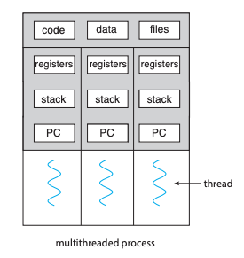
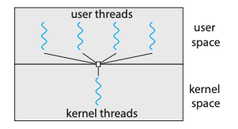
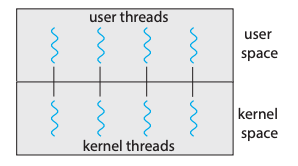
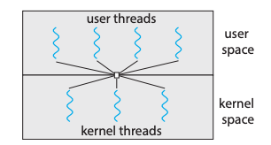
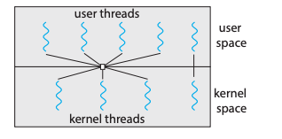

# 4주차 스터디 정리

## Threads
Thread : Process의 작업 흐름  
Single thread : 하나의 프로세스가 한 번에 하나의 작업만 수행하는 것  
Multi thread : 하나의 프로세스가 동시에 여러 작업을 수행하는 것  

## Multi-threading
멀티쓰레딩의 장점 
- stack 영역을 제외한 모든 메모리를 공유하기 때문에 economic! context-switching 시 해당 영역만 변경해주면 됨
- Process context-switching에 비해 Thread context-switching이 lower overhead! Process context-switching은 System call을 호출하기 때문이다. 

## Multicore Programming
- Concurrency(동시성) : 싱글 프로세서 시스템에서 사용되는 방식으로, 프로세서가 여러 개의 스레드를 번갈아가며 수행함으로써 동시에 실행되는 것처럼 보이게 하는 방식
- Parallelism(병렬성) : 멀티코어 시스템에서 사용되는 방식으로, 여러 개의 코어가 각 스레드를 동시에 수행하는 방식

## User Threads and Kernel Threads
User Thread는 사용자 수준의 스레드 라이브러리가 관리하는 스레드다. 스레드 라이브러리에는 대표적으로 POSIX Pthreads, Win32 threads, Java threads가 있다.   
커널 스레드는 커널이 지원하는 스레드다. 커널 스레드를 사용하면 안정적이지만 유저 모드에서 커널 모드로 계속 바꿔줘야 하기 때문에 성능이 저하된다.   
반대로 유저 스레드를 사용하면 안정성은 떨어지지만 성능이 저하되지는 않는다.

## Multithreading Models
- Many-to-One Model
  - 하나의 커널 스레드에 여러 개의 유저 스레드를 연결하는 모델
  - 한 번에 하나의 유저 스레드만 커널에 접근할 수 있기 때문에 멀티코어 시스템에서 병렬적인 수행을 할 수가 없다. 요즘에는 잘 사용되지 않는 방식이다.
  

- One-to-One Model
  - 하나의 유저 스레드에 하나의 커널 스레드가 대응하는 모델
  - 동시성을 높여주고, 멀티프로세서 시스템에서는 동시에 여러 스레드를 수행할 수 있도록 해준다. 
  - 유저 스레드를 늘리면 커널 스레드도 똑같이 늘어나는데, 커널 스레드를 생성하는 것은 오버헤드가 큰 작업이기 때문에 성능 저하가 발생할 수 있다.
  

- Many-to-Many Model
  - 여러 유저 스레드에 더 적거나 같은 수의 커널 스레드가 대응하는 모델
  - 운영체제는 충분한 수의 커널 스레드를 만들 수 있으며, 커널 스레드의 구체적인 개수는 프로그램이나 작동 기기에 따라 다르다. 
  - 멀티프로세서 시스템에서는 싱글프로세서 시스템보다 더 많은 커널 스레드가 만들어진다.  
  

- Two-level Model
  - Many-to-Many 모델과 비슷한데, 특정 유저 스레드를 위한 커널 스레드를 따로 제공하는 모델을 말한다. 
  - 점유율이 높아야 하는 유저 스레드를 더 빠르게 처리해줄 수 있다.  
  

