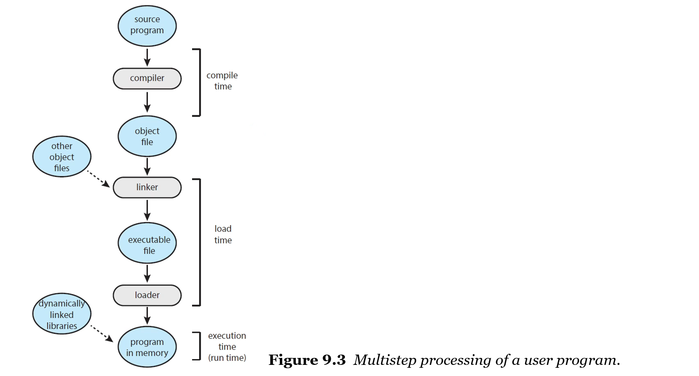
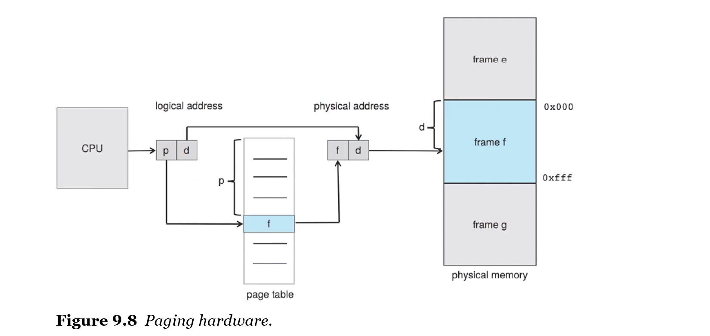
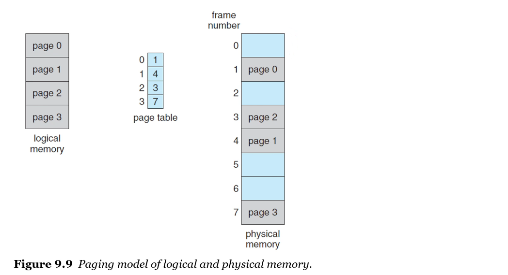
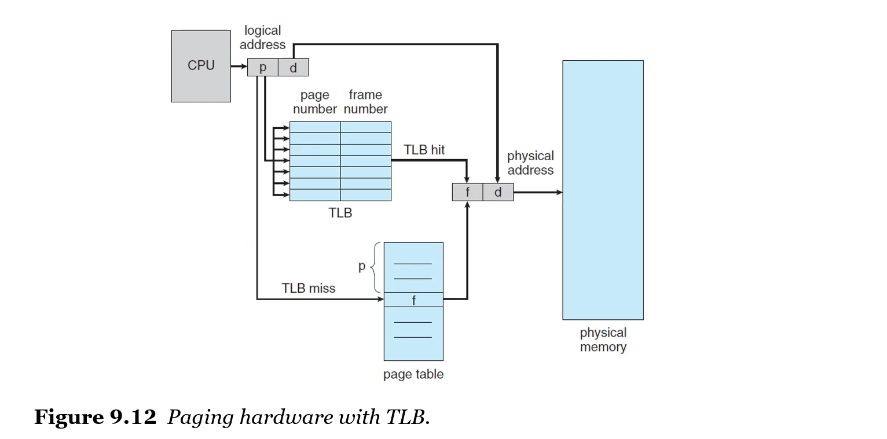
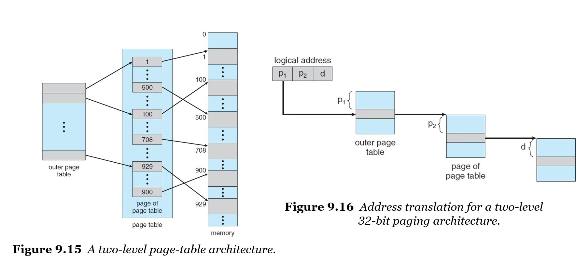
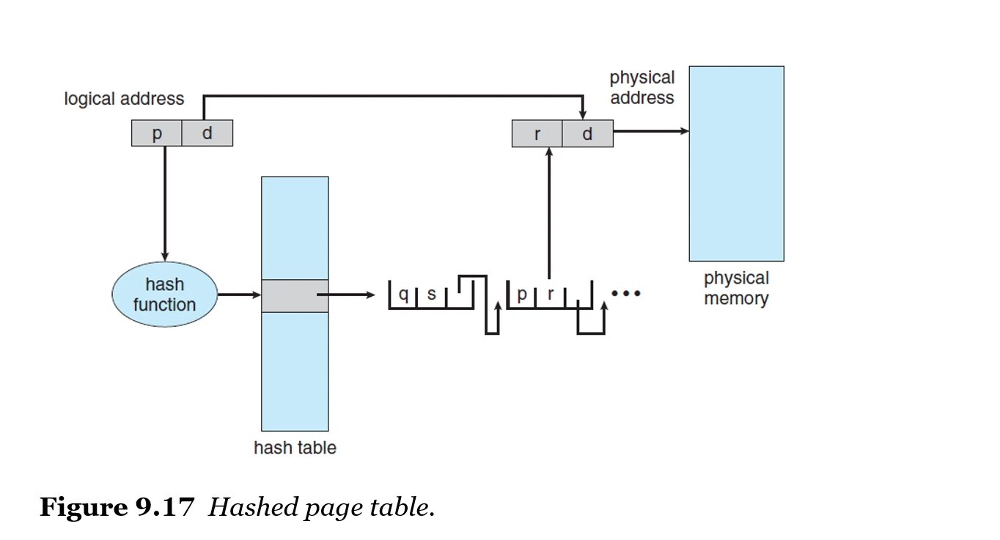
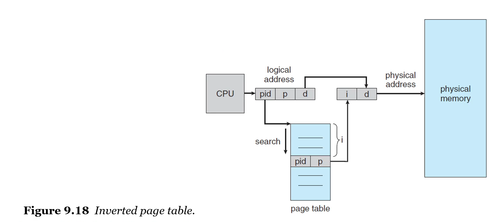
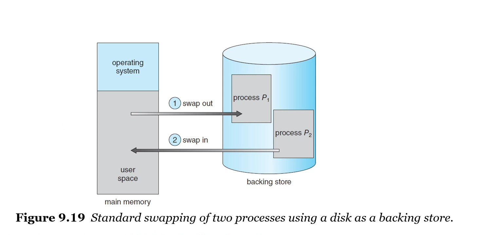
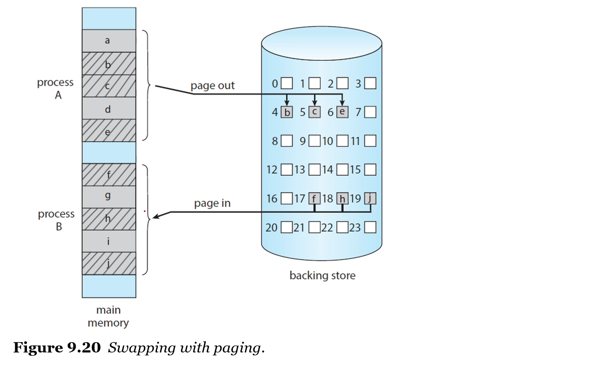

# Main Memory

▪ A process is a program in execution
- a set of instructions kept in a *main memory*

▪ Memory
- 구성
    - a large *array of bytes*
    - each with its own *address*
- CPU는 program counter를 사용해 메모리에서 명령(instructions)을 가져온다(fetch)
- instructions은 메모리에 load 또는 store 할 수 있다

▪ Memory Space
- each process has a *separate memory space*
- A pair of registers: **base register** and **limit register**
    - legal address space를 정의

▪ Protection of memory space
- CPU 하드웨어를 사용하여 메모리 공간 보호
- user mode에서 생성된(generated) 모든 주소를 register와 비교
- CPU가 address access할 때 base register보다는 크거나 같고, base+limit 보다는 작을 때 메모리 엑세스 허용

 

**▪ Address Binding**
- 프로그램에서 주소를 다루는 방식은 단계별로 모두 다름
    - Multistep processing of a user program
    - 변수 선언에서 메모리 할당은 컴파일러가 해준다(특별히 주소를 지정해주지 않는 이상)
    - 컴파일러는 .exe 또는 .out 인 binary file을 생성할 뿐, 이 파일이 메모리 몇 번지에 올라가는지는 알 수 없다
    - 변수는 symbolic하다
    - 컴파일러가 만든 .exe 파일도 프로그램일 뿐, binary executable file로 디스크에 저장되어 있다. 불러오기 전까지는 이진수 형태의 정보일 뿐.
- 프로그램은 바이너리 실행 파일로 디스크에 존재
- 실행하려면 프로그램을 메모리로 가져와야 한다
    - 프로그램을 메모리에 가져오면 process가 된다
- 프로세스의 주소는 00000000에서 시작하지 않는다
    - 메모리가 load될 주소는 OS 커널이 결정, 그때그때 다름
- 소스 주소는 일반적으로 symbolic(상징적)하다
- compiler는 **symbolic** addresses를 **relocatable** addresses로 bind한다
- linker와 loader는 (차례대로) relocatable addresses를 absolute addresses로 bind한다
    - a.out 파일로 만들 때 linker가 하나의 logical한 address를 만들어낸다
        - symbolic address를 linking한다
    - loader가 로딩하면서 또 binding한다
        - relocatable(logical) addresses -> absolute(physical) addresses
- Multistep processing of a user program
    - 
        - source program: symbolic
        - object file: relocatable (by compiler)
        - executable file: logical (by linker)
        - program in memory: physical (by loader)

 

▪ Logical .vs. Physical Address Space
- logical address: **CPU**에 의해 생성된 주소
- physical addres: **메모리** 유닛에 의해 보여지는 주소
    - 즉, 메모리 주소 레지스터에 로드되는 주소 체계
- logical address space: user program에 의해 생성된 모든 logical address의 집합
- physical address space: logical addresses에 대응하는 모든 physical address의 집합
- user program이 사용하고 있는 주소는 logical에 불과하므로 이를 하드웨어 메모리에 있는 physical address에 맵핑해야 한다

 

▪ MMU (Memory Management Unit)
- 프로그램 실행 중(run-time)에 logical addr.을 physical addr로 mapping(변환) 하는 하드웨어 장치
- relocation register: MMU에서 base register
- relocation register(=base register) 속에 있는 값이, 메모리로 보내지는 logical address 값과 더해져 physical address 값이 된다

 

▪ Dynamic Loading
- 실행 프로그램과 데이터 전체를 (.exe 파일 전체)가 physical memory에 있어야 하는가?
    - 그러면 시스템 뻗는다
- dynamic loading: 효율적인 메모리 공간 활용
    - routine은 호출될 때까지 load되지 않는다
- 필요할 때만 routine이 load된다 - relocatable linking loader가 호출됨
- 프로그램의 주소 테이블을 업데이트해서 변경사항 반영

 

▪ Dynamic Linking and Shared Libraries
- DLLs: Dynamically Linked Libraries
    - 프로그램이 실행될 때 user programs에 link된 system libraries
- static linking
    - 시스템 라이브러리는 다른 object module들처럼 취급된다
    - loader에 의해 binary program code로 결합된다
- dynamic linking
    - dynamic loading과 유사
    - here, thought, linking은 execution time까지 연기된다(postponed) => 실행 중일 때 linking한다
- shared library: DDLs은 shared libraries라고도 한다
    - 메인 메모리에서 DDL의 인스턴스는 단 하나 뿐이기 때문에,
    - 여러 프로세스(multiple user processes) 간에 공유될 수 있다

 

▪ Contiguous Memory Allocation
- 효율적으로 메인 메모리를 할당하는 방법 중 하나로, **연속 메모리 할당**을 고려해볼만 하다
- 메모리는 통상적으로 두 개의 파티션으로 나뉜다
    - 운영체제용 파티션
    - 유저 프로세스용 파티션
- 여러 **user processes가 메모리에 동시에 머무를 수 있어야** 하기 떄문에, 사용 가능한 메모리를 어떻게 할당해야 할지 결정해야 한다
- 연속 메모리 할당은 프로세스를 여러 구역이 아니라 **단일 구역에 할당**한다. 즉, **연속적으로 할당**한다
- 각 프로세스는 single section of memory(메모리의 단일 섹션)에 포함된다

▪ Memory Protection
- 연속 메모리 할당에서 메모리를 보호하기 위해서, relocatio register + limit register 사이에서만 프로세스가 할당될 수 있게 한다

 

▪ Memory Allocation (메모리 할당)
- Variable-Partion scheme (가변 파티션 방식)
    - 메모리에 할당되는 프로그램의 크기에 따라 분할의 크기 혹은 수가 계속해서 변하는 방식
    - hole: 사용 가능한 메모리 블럭
        - 프로세스가 도착하면, 공간이 넉넉한 hole을 할당한다
    - 프로세스를 hole에 할당하는 만큼, hole을 잘 관리해야 메모리를 효율적으로 사용할 수 있다
        - First-Fit: 할당할 수 있는, 즉 크기가 맞는 홀이 보이면 바로 할당하는 방법
        - Best-Fit: 할당할 수 있는 가장 작은 홀에 할당하는 방법
        - Worst-Fit: 할당할 수 있는 가장 큰 홀에 할당하는 방법

 

▪ Fragmentation (단편화 문제)
- 연속 메모리 할당을 진행하다 보면, 메모리가 존재하지만 사용 불가능한, 즉 단편화 문제가 발생
- external fragmentation(외부 단편화)
    - contiguous memory allocation에서 발생하는 문제
    - 메모리 공간이 작은 holes로 나누어져 있어 충분한 메모리 공간이 있음에도 할당을 받을 수 없는 상태
    - 사용 가능한 공간이 인접(contiguous)하지 않다
    - ex) 50MB가 할당이 가능한 상태에서, 3MB의 메모리 할당 요청이 들어와도 2MB로 메모리가 나뉘어져 있어 할당을 받지 못한다
    - 해결 방법
        - 사용중인 메모리 영역을 한 곳으로 몰고, hole들도 한 곳으로 합쳐, 큰 메모리 공간을 만드는 => 즉 **압축**으로 해결한다
- internal fragmentation(내부 단편화)
    - paging에서 발생하는 문제
    - 프로세스가 필요로 하는 양보다 더 크게 메모리를 할당해 공간이 낭비되는 상태
    - 파티션 내부에 있는 unused memory

 

▪ Segmentation
- paging과 유사하지만, 가변 크기의 "page"를 사용
- segment(종류/영역)별로 쪼갠다
- 가변 크기이므로 외부 단편화 문제는 더 심각해진다
- paging이 훌륭한 solution

 

▪ Memory Allocation
- Contiguous Memory Allocation
- Paging

 

# Paging

▪ Paging
- 프로세스의 물리적 주소 공간을 **비연속적으로(non-contiguous) 배치**하는 메모리 관리 체계
- contiguous memory allocation의 외부 단편화 문제와 압축 문제를 해결
- 운영체제와 컴퓨터 하드웨어의 도움을 받아 구현

▪ Basic Method for Paging
- **physical** memory를 고정된 크기(**fixed-sized blocks**)로 자른다 => **frame**
- **logical** memory를 frame과 같은 크기, 즉 고정된 크기로 자른다 => **page**
- logical address space는 physical address space와 완전히 분리되었기 때문에 물리적 주소 공간을 크게 고려하지 않아도 되고, 이 둘 사이의 매핑은 운영체제가 알아서 해준다.
- 연속 메모리 할당처럼 프로그램 전체를 한 번에 올릴 필요 없이, 조각을 물리적 메모리의 위치에 맞게 할당하면 된다.
- CPU에 의해 생성되는 모든 주소, 즉 논리적 주소는 두 파트로 분류된다
    - a page number (p)
    - a page offset (d)
- 하나의 프로세스라도 한 번에 물리적 메모리 공간에 올리는 것이 아니라, 페이지 단위로 물리적 메모리에 올리는 위치가 모두 다르기 때문에 두 파트를 이용하는 것이다
- 두 파트를 이용하여 어떤 프로세스의 몇 번째 페이지가 물리적 메모리의 어느 공간에 위치해 있는지 알 수 있다

▪ The page number
- 모든 프로세스는 주소 변환을 위해 page table을 가진다
- page number는 프로세스별 **page table**의 **index** 값으로 사용된다
- 

▪ CPU 실행 단계
- logical address에서 physical address로의 변환
1. page number *p*를 추출하여 page table의 index로 사용한다
2. page table에서 대응하는 frame number *f*를 추출한다
3. page number *p*를 frame number *f*로 바꾼다
- 

▪ The page size (like the frame size)
- page size는 하드웨어에 의해 정해진다
- 2의 제곱이어야 하고 사이즈는 보통 4KB~1GB 정도 차지
- logical address space 크기가 2^m이고 page size가 2^n일 때
    - 상위 m-n 비트는 page number
    - 하위 n 비트는 page offset(간격)

▪ 프로세스가, 실행될 시스템에 도착할 때
- page로 표현된 프로세스의 크기가 메모리 할당을 위해 검사된다
- 할당되지 않은 프레임들은 리스트로 관리되다가, 프로세스가 실행될 때 순차적으로 페이지를 메모리에 할당한다

▪ Hardware Support
- CPU 스케줄러가 실행할 프로세스를 선택하면, page table은 context switch를 위해 reload되어야 한다
- page table에 대한 pointer는 각 프로세스의 PCB에 다른 레지스터 값과 함께 저장되어야 한다
- page table의 크기가 갈수록 무겁고 다양해지면서, 하드웨어만으로 page table을 관리하는 것이 힘들어졌다

**▪ PTBR (page-table base register)**
- PTBR은 메인 메모리에 있는 **page table**(의 시작 번지)를 가리킨다
- context switching의 속도는 빨라졌지만, 여전히 메모리 접근 시간은 느린데, 그 이유는 두 번이나 메모리 접근을 실행하기 때문이다
    - 메인 메모리에 있는 page table에 접근
    - page table 내에 있는 실제 data에 접근

**▪ TLB (Translation Look-aside Buffer)**
- 
- a special, small, fast-lookup hardware cache memory
- 메모리 접근 시간을 향상시키기 위한 캐시 메모리
    - 캐시 메모리: 메인 메모리에서 빈번하게 사용하는 데이터를 캐시에 저장해 CPU에 더 빨리 접근할 수 있게 해주는 하드웨어
- TLB에는 빈번하게 사용되는 페이지 일부를 저장하고 있다
- CPU에서 메인 메모리의 page table에 접근하기 전에 TLB에 접근하여 페이지 정보가 있다면 곧바로 주소 변환이 이루어진다
- Effective Memory-Access Time
    - TLB hit: 페이지 넘버가 TLB 안에 포함되어 있을 때
    - TLB miss: 페이지 넘버가 TLB 안에 포함되어 있지 않을 때
    - hit ratio: TLB hit 발생률, 이에 따라 EAT(Effective Memory-Access Time)이 조정된다
- 시스템의 메모리 접근 시간이 10ns일 때 계산 방법
    - 80% hit ratio 의 EAT : 0.80 X 10 + 0.20 X 20 = 12ns
    - 99% hit ratio 의 EAT : 0.99 X 10 + 0.01 X 20 = 10.1ns

▪ Memory Protection with Paging
- paging에서 메모리 보호는 각 프레임별 protection bits(보호 비트)에 의해 이루어진다
- valid-invalid bit(유효-무효 비트)
    - one additional bit
    - 각 page table에 모두 첨부된다
    - 비트가 유효한 경우: 해당 페이지가 프로세스의 logical address space에 포함되어 있다 (legal)
    - 비트가 무효한 경우: logical address space에 포함되어 있지 않은 페이지 (illegal)
        - 즉 프로세스가 주소 부분을 사용하지 않거나 백킹 스토어에 접근하여 권한이 없는 경우
    - illegal address가 들어오면 valid-invalid bit를 이용해 interrupt를 건다

▪ Shared Pages
- paging의 장점은 공통 코드를 공유할 수 있다는 것이다 (sharing common code)
- multiprogramming 환경에서 큰 장점
- ex) C에서 libc 라이브러리를 각 프로세스마다 복사해서 load하는 건 매우 비효율적이므로 reentrant code, 즉 실행중에 변할 일이 없는 코드(non-self-modifying code)는 프로세스끼리 공유하는 것이 효율적이다
    - 하나의 물리 메모리를 공유
    - 프로세스들은 읽기만 하므로 동기화 문제 x

 

▪ Structure of the Page Table
- 논리적 주소 공간이 커질수록 페이지 테이블 역시 지나치게 커지므로, 이에 맞춰 페이지 테이블을 효율적으로 구조화할 필요가 있다.
- Hierarchical Paging
    - 
    - logical address space를 여러 테이블로 나눈다
    - page table의 page table을 만드는, 즉 페이지 테이블을 쪼개는 방법
    - 페이지 테이블 자체가 너무 커질 때 사용하는 방법으로, 외부 페이지 테이블과 내부 페이지 테이블 사용
    - 페이지 단계 수가 증가할수록 메모리 접근 횟수도 많아져 적절하게 사용해야 한다
- Hashed Page Table
    - 
    - hash 자료구조의 낮은 시간 복잡도가 장점
    - 32bit 이상의 주소 공간을 제어할 때 주로 사용하는 구조
    - 해시 값이 virtual page number인 해시 테이블 사용
- Inverted Page Table
    - 
    - 어떤 프로세스가 어떤 페이지를 가지고 있는지 역으로 체크하는 방법
    - page table에 프로세스의 id(pid)를 추가하여 해당 프로세스의 페이지를 추적한다
    - 메모리 프레임마다 한 항목씩 할당, 가상 주소로 구성
    - 각 항목은 프레임에 올라와 있는 페이지 주소, 페이지를 소유하고 있는 pid(주소 공간 id)를 표시한다
    - 시스템에는 단 하나의 page table만이 존재하게 되고 테이블 내 항목은 메모리 한 프레임을 가리킨다

 

# Swapping

▪ Swapping
- 실제 시스템의 physical memory보다 더 큰 프로세스를 실행할 수 있다
- 시스템 멀티 프로그래밍의 빈도를 조절하는, 즉 메모리상의 프로세스의 수를 조절할 수 있다.
- 프로세스의 명령어와 데이터는 메모리에 올라와 있어야 실행이 가능한데, 메모리가 부족한 경우 프로세스 혹은 프로세스의 일부를 메모리에서 백킹 스토어로 일시적으로 스왑한다.
- 필요하면 백킹 스토어에서 다시 가져와 실행한다

▪ Standard Swapping
- 
- 전체 프로세스가 backing store와 메인 메모리 사이를 스왑하는 것
- 전체 프로세스 스왑은 cost가 커 시스템에 부담을 줄 수 있다

▪ Swapping with Paging
- 전체 프로세스를 스왑하는 대신 프로세스의 페이지를 스왑하는 방법
- physical memory와 logical memory로 분리할 수 있다
- 아주 작은 단위의 페이지도 스왑할 수 있다
- 오늘날 paging이라는 말은 swapping 가능한 paging을 일컫는다
    - page out: 메모리에서 backing store로 페이지가 이동
    - page in: backing store에서 메모리로 페이지가 이동
- 가상 메모리에서 장점이 큰 방법
- 

https://velog.io/@hoyaho/%EC%9D%B8%ED%94%84%EB%9F%B0-%EA%B3%B5%EB%A3%A1%EC%B1%85-%EC%A0%95%EB%A6%AC-Section-10-%EF%BD%9C-CS-Study