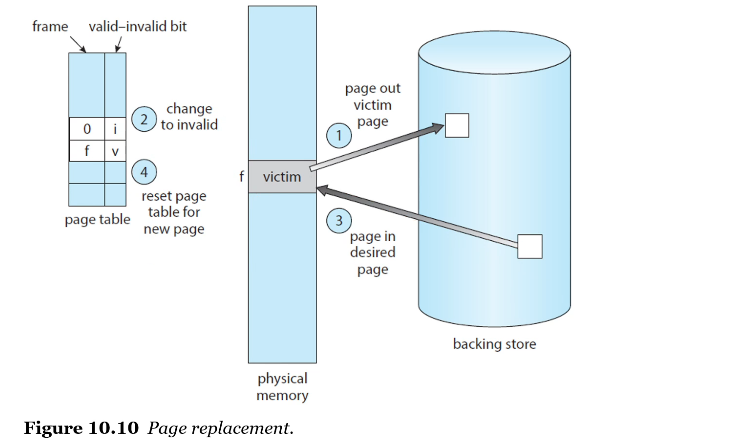

# Virtual Memory

▪ Virtual Memory
- 메모리에 완전히 적재되지 않아도 프로세스의 실행을 가능하게 하는 기술
- 프로그램은 physical memory(실제 메모리)보다 클 수 있다
- main memory를 매우 큰 storage array로 추상화(abstract)한다 -> 즉 logical(virtual) memory로 둔다
- 실행이 필요한 부분만 실제 physical memory에 옮긴다
- 위 방법을 통해 logical memory와 physical memory의 완전한 분리가 가능하다
- 파일, 라이브러리 공유 및 프로세스 생성에 효율적인 메커니즘을 제공한다
- 
- physical memory가 실제 프로세스 실행의 main memory
- backing store(주로 HDD)는 sub memory(제2저장장치)

 

▪ Virtual Address Space
- 프로세스가 메모리에 저장되는 방식에 대한 logical(virtual) view
- 
- 보통 주소는 0으로 시작되며, 연속 메모리에 존재
- `stack`, `heap`은 고정 크기가 아니며, 함수를 호출하면 `stack` 영역이 늘어나고, 동적 메모리 할당 시 `heap` 영역이 늘어난다
    - 이 부분을 sparse address space(성긴 주소 공간)이라고 한다
    - sparse address space의 공백은 stack이나 heap 세그먼트가 확장될 때 사용되거나 프로그램 실행 중 동적으로 라이브러리를 링크할 필요가 있을 때 사용한다
- `stack`, `heap` 공간 사이에 `shared library`가 위치해 있고, `page sharing`를 통해 2개 혹은 더 많은 프로세스끼리 파일, 메모리를 공유할 수 있다
- 

 

# Demand Paging

▪ Demand Paging
- executable program은 secondary storage(보조 기억 장치)에서 메모리로 적재되어야 실행된다(process)
- 전체 프로그램을 physical memory에 load하면 용량이 부족할 수 있기 때문에 대안이 필요 -> Demand Paging(요청 페이징)
- 실행 중에 요청이 들어올 때만 필요한 페이지를 load한다
- 가상 메모리에서 주로 사용하는 기법. 중요

 

▪ Basic Concepts of the Demand Paging
- 프로세스가 실행중일 때 몇몇 페이지들은 memory에 있고, 몇몇은 secondary storage에 있다
- 페이지가 어디에 위치해 있는지 구별하기 위해
    - `valid-invalid bit` scheme 사용
    - page table에 frame과 valid-invalid bit
    - valid: 페이지가 legal하고, 메모리에 있다
    - invalid: 페이지가 illegal하거나 secondary storage에 있다
    - dirty bit를 사용해서 illegal한 경우와 secondary storage에 있는 경우를 나눌 수 있다

 

▪ Page Fault
- main memory에 load되지 않은 page에 접근했을 때 발생
- page fault가 발생하면 MMU가 OS에 trap을 발생시킨다
- page fault 발생 시 해결 절차
    1. process의 internal table(일반적으로 PCB(프로세스 제어 블록)과 함께 보관)에서 reference가 valid or invalid memory access인지 확인한다
    2. reference가 invalid인 경우 프로세스를 종료하고, valid bit이지만 page fault인 경우 page in된다
    3. free frame을 찾는다 (free-frame list에서 하나 선택)
    4. secondary storage를 스케줄링하여 필요한 페이지를 새로 할당된 frame으로 이동시킨다
    5. storage read가 완료되면, 프로세스와 함께 유지되는 internal table과 page table을 수정해서 page가 지금 memory에 있음을 나타낸다
    6. trap에 의해 중단된 instruction을 restart한다
- 

 

▪ Pure Demand Paging
- 요청받을 때까지 page를 memory로 가져오지 않는다
- 메모리에 페이지가 없는 프로세스 실행을 시작할 때
    - OS가 (non-memory resident page에 있는) 프로세스의 first instruction으로 instruction pointer를 설정하고
    - 프로세스는 즉시 page fault가 발생한다
    - 프로세스의 페이지가 page in된다
    - 메모리에 있어야 할 모든 page가 들어올 때까지 faulting하면서 프로세스를 실행한다
- 그때그때 페이지를 로딩해와야 하기 때문에 메모리는 절약되나 속도가 상당히 느리다
- 많이 사용하는 방법은 x, 보통 프로세스 일부 페이지를 미리 로드하고 시작한다

 

▪ Locality of References
- 이론적으로 일부 프로그램은 각 instruction execution이 여러 새 메모리 페이지에 access할 수 있으므로 instruction(명령)당 여러 page fault가 발생할 수 있다
- 실행 중인 프로그램을 분석한 결과 이러한 행위가 거의 발생하지 않는 것으로 나타났다 -> locality of reference의 특성 덕분
- 프로그램에는 locality of reference(참조 지역성)을 가지는 경향이 있다
- locality of reference: 프로세서가 짧은 시간 동안 동일한 메모리 위치 집합에 반복적으로 access하는 경향
- Temporal Locality(시간적 지역성): 어떤 지역(data 또는 instruction)이 참조되면 그것은 가까운 미래에 다시 참조될 가능성이 높다 - 반복문, 서브루틴, 스택
- 공간적 지역성: 참조된 지역의 근처에 위치해 있는 메모리는 가까운 미래에 참조될 가능성이 높다 (명령어, 배열 내 요소)
- locality of reference는 demand paging에서 합리적인 성능을 보인다
- 데이터 구조와 프로그래밍 구조를 신중하게 선택하면 코드나 데이터의 지역성을 높일 수 있다 -> page fault 비율을 낮추고 시스템 성능을 향상시킨다

 

▪ Hardware Support to Demand Paging
- Demand Paging 처리를 위해 하드웨어 지원이 필요하다
- `Page table`(가상 테이블)은 페이지 유효/무효 여부를 체크한다
- `Secondary memory(=swap space)`는 메인 메모리에 없는 page를 보유한다 secondary memory는 주로 high-speed disk 또는 nvm 장치

 

▪ Instruction Restart
- Demand Paging의 중요 requirement - page fault 후 instruction을 다시 시작하는 기능
- page fault가 발생하면
    - interrupt된 프로세스의 상태(registers, condition code, instruction counter 등)가 저장된다
    - page가 page out된다(trap에 의해 wait queue로 이동)
    - page in되면 정확히 같은 상태와 위치에서 restart해야 한다
- 프로세스별로 page table을 잘 관리해야 한다(page table 동시 접근 방지 위함)
- instruction fetch(명령을 가져오는) 중에 page fault가 발생하면 다시 instruction을 fetch해서 restart한다
- operand(연산) fetch 중에 page fault 발생하면 instruction을 fetch and decode한 다음 다시 연산을 fetch한다

 

▪ Free Frame List
- Linked List로 frame을 관리하는 Pool로, page fault를 해결하기 위해 os는 free frame list를 가진다
- page fault가 발생하면 secondary storage에서 memory로 페이지를 가져오는데, 이 때 free(비어있는) frame list로 접근한다
- 프로세스의 stack 또는 heap segments가 확장될 때도 free frame이 할당되어야 한다

 

▪ Performance of Demand Paging
- demand-paged memory의 `Effective Access Time`을 계산
- ma: memory-access time
- p: page fault가 발생할 확률(probability)
- EAT = (1 - p) * ma + p * (page fault time)
- page fault 처리에서 많은 시간을 차지하는 three major activities(작업)
    - Service the page-fault interrupt - page fault 인터럽트를 처리
    - Read in the page - page를 읽어들이는 과정(가장 많은 시간 차지)
    - Restart the process - 프로세스 재시작

 

▪ Copy-on-Write
- 
- write할 때 copy하자
- 프로세스가 shared page에 `write`할 때만 해당 shared page를 copy한다
- fork(), exec()에서 발생할 수 있는 상황
- copy 후 page table 수정

https://os.ecci.ucr.ac.cr/slides/Abraham-Silberschatz-Operating-System-Concepts-10th-2018.pdf

p513

 

# Page Replacement

- Demand Paging을 구현할 때 고민해야 할 점
    1. 어떤 프로세스에 몇 개의 프레임을 할당할지(Frame-allocation algorithm)
    2. 빈 리스트가 없을 때 어떤 프레임을 희생시킬지(`Page-replacement algorithm`)**
- 기본적으로 secondary storage의 I/O 작업은 시간이 오래 소요되므로(expensive), demand paging 방법을 조금만 개선해도 system performance(성능)를 크게 향상시킬 수 있다

 

▪ Page Replacement
- 페이지를 프레임에 할당해야 할 때, free frame이 없다면
- 현재 사용되지 않고 있는 프레임을 찾아 해제(free)시킨다 -> 해당 contents를 swap space에 write해서 frame을 free시키고, page table을 변경해서 페이지가 더이상 메모리에 없음(invalid or dirty)을 나타낸다
- freed(해제된) frame을 사용하여, 프로세스 장애가 발생했던 페이지를 보유한다(hold)
- 

 

▪ Page Fault Service include Page Replacement
1. secondary storage에서 해당 페이지의 위치를 찾는다
2. a free frame을 찾는다
    - free frame이 있으면, 사용한다
    - free frame이 없으면, page-replacement algorithm을 사용해서 a victim frame을 선정한다
    - the victim frame을 secondary storage에 write하고 (필요한 경우), page 및 frame table을 변경한다
    - 할당할 page를 newly freed frame으로 읽어들이고, page 및 frame table을 변경한다
    - page fault가 발생한 위치에서 프로세스를 continue한다

 

▪ Evaluation of Page Replacement Algorithms
- PR 알고리즘의 최종 목표는 page fault를 최소화하는 것
- frame 수가 많아질수록 page fault 역시 줄어든다 (the more frames, the less page faults)
- reference string: a string of memory references. memory reference를 페이지 번호 단위로 나열한 것
- reference string으로 page fault 개수를 계산해서 이를 최소화할 수 있는 알고리즘을 design한다

 

▪ FIFO Page Replacement
- First-In-First-Out, the simplest algorithm
- page가 교체되어야할 때 the oldest page를 victim으로 선정
- Belady's Anomaly(벨라디의 모순)이 발생한다
    - 일반적으로 프로세스의 가상 메모리에 대한 프레임 수를 늘리면 page fault 발생이 줄어든다
    - 하지만 원칙에 맞지 않게 frame 수가 많아졌음에도 page fault 발생 수가 늘어나는 현상
    - 일부의 경우 프로세스에 할당된 frame이 증가할수록 page-fault rate가 증가할 수 있다

 

▪ Optimal Page Replacement
- optimal algorithm은 lowest page-fault rate를 가지고, Belady's anomaly를 겪지 않는 것
- OPT or MIN
    - 가장 오랫동안 사용하지 않을 page를 교체한다
- OPT는 the lowest possible page-fault rate를 보장할 것이다
- reference string에 대한 future knowledge가 필요
- 실행되는 시점에서는 미래에 어떤 페이지가 올지 알 수 없기 때문에 실질적으로 사용할 수 없는 알고리즘. 때문에, 주로 비교 연구(comparison studies)에 사용

 

▪ Recall the Shortest-Job-First CPU scheduler
- the key distinction(주요 차이점) between the FIFO and the OPT
- FIFO
    - looking backward: when a page was brought in?
- OPT
    - looking forward: when a page to be used?
- recent past를 near future의 근사치(approximation)으로 사용하면 가장 오랫동안 사용되지 않은 page를 교체할 수 있다 -> LRU

 

▪ LRU Page Replacement
- LRU: Least Recently Used (최근에 가장 사용되지 않은, 가장 최소로 사용된)
- 가장 오랫동안 사용되지 않은 페이지를 victim으로 선정하는 알고리즘
- 최적 알고리즘 방식과 비슷한 성능을 내기 위해 고안한 알고리즘
- 앞으로 사용할 페이지를 '예측'하여 희생자를 선정하는 방법으로, 과거에 오랫동안 사용하지 않았다면 미래에도 많이 사용하지 않을 것이라고 예측하는 것
- 각 페이지에 해당 페이지가 마지막으로 사용된 시간을 연결하고, 가장 오랫동안 사용되지 않은 페이지를 선택한다
- 성능이 높아 실제 자주 사용하고, Belady's Anomaly이 발생하지 않는다
- 하지만 LRU 알고리즘을 구현하기 위해서는 frame이 언제 마지막으로 사용되었는지에 대한 정보를 저장해야 하므로, 하드웨어의 지원이 필요하다
    - 가능한 두 가지 구현 방법
    - `counter` and `stack`
- `Counter` implementation
    - **페이지 참조가 발생할 때마다 시간을 체크하는 방법으로, 페이지 교체가 일어나야 하는 경우 가장 시간이 오래된 페이지를 victim으로 선정한다**
    - **페이지가 참조될 때마다 counter 또는 clock을 copy하고, page를 가장 작은 값으로 바꾼다**
    - **페이지 변경이 필요할 때 페이지 테이블에서 가장 오래된 것을 찾아야 하고, 페이지 테이블이 변경될 때마다 페이지의 시간도 함께 변경해야 하는 단점이 있다**
    - 각 page-table 항목을 time-of-use 필드와 연관시키고 CPU에 logical clock(시간) 또는 counter를 추가한다
        - logical clock: 분산 시스템에서 시간순 및 인과관계를 캡처하는 메커니즘
        - cf. clock(클럭): CPU의 속도를 나타내는 단위. 클럭 속도는 프로세서가 1초에 전체 처리 주기를 완료하는 속도이다
        - counter: 종종 클럭 신호와 관련하여 특정 이벤트나 프로세스가 발생한 횟수를 저장(때로는 표시)하는 장치. 회로에서 발생하는 특정 이벤트를 계산할 수 있다
    - clock은 모든 메모리 참조에 대해 증가한다
    - page가 참조될 때마다 clock register의 내용이 해당 페이지의 page-entry에 있는 time-of-use 필드에 copy된다
    - 각 페이지에 대한 마지막 참조(last reference)의 '시간'을 갖고 있다
    - 페이지를 가장 작은 시간 값(the smallest time value)으로 바꾼다
- `Stack` implementation
    - page number를 stack에 저장한다
    - page가 참조될 때마다 entries(푸시된 항목)는 **stack 중간에서 제거되고 상단에 올라간다**
        - `항목은 스택 중간에서 제거되어야 하므로` head pointer와 tail pointer가 있는 이중(doubly) linked list를 사용하여 접근 방식을 구현하는 것이 가장 좋다
    - 최근 사용된 페이지는 항상 stack의 top에 있고, 가장 오래전에 사용된 페이지는 bottom에 위치하게 된다

 

▪ LRU-Approximation Page Replacement
- 많은 컴퓨터 시스템들은 LRU page replacement를 위한 충분한 하드웨어 지원을 제공하지 않는다
- 하지만 Reference bit(참조 비트) 형태로 약간의 도움을 준다
- 페이지의 참조 비트는 해당 페이지가 참조될 때마다 하드웨어에 의해 설정된다
- reference bit
    - 초기값은 0 (by OS), 각 페이지마다 할당된다
    - 페이지가 참조되면 1
    - 비트 값이 0인 page 중에서 victim으로 선정, replace한다
    - 사용 순서는 알 수 없다

 

▪ Second-Chance Algorithm
