# Storage Management

▪ Mass-Storage
- 컴퓨터의 non-volatile(비휘발성), secondary storage system(보조기억장치)이다
- 보통 HDD(Hard Disk Drive)나 NVM(Non-Volatile Memory)를 의미
    - cf. NVM: 비휘발성 메모리, 전원이 공급되지 않아도 저장된 정보를 계속 유지하는 컴퓨터 메모리
- 가끔씩 마그네틱 테이프, 광학 디스크, 클라우드 저장소를 의미하기도 한다
    - RAID systems의 구조 사용
    - RAID: Redundant Array of Independent Disk
    - 여러 개의 하드 디스크에 일부 중복된 데이터를 나눠서 저장하는 기술

 

▪ Hard Disk Drives
- 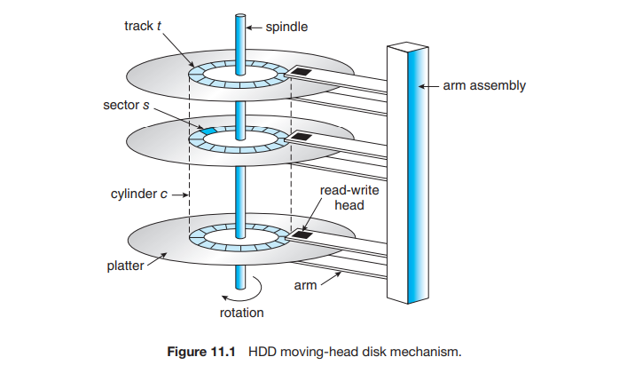
- 대용량 데이터를 저장하는 용도로 사용
- 하드디스크 구조
    - spindle: 디스크를 회전시켜 내용을 읽고 쓰는 역할로, rpm(rounds per minute)이 splindle 모터의 회전 속도를 의미
    - platter: 실제 데이터가 저장되는 위치, 여러 트랙으로 구성
    - track: 데이터가 저장되는 공간
    - sector: 데이터 저장의 최소 단위, 하나의 파일만 저장 가능
    - cylinder: platter 표면 동일 트랙들의 집합
    - arm: 헤드를 움직이는 역할
    - read-write head: 데이터를 저장 혹은 삭제하며, 데이터를 읽어들이는 역할도 수행
    - block: 여러 섹터를 하나로 묶은 것

 

▪ HDD Scheduling
- 스케줄링의 목적은 access time( 또는 **seek time**, 탐색 시간)을 최소화하고 data transfer **bandwidth(대역폭)**을 최대화하는 것
- seek time: arm이 head를 해당 sector가 포함된 cylinder로 이동하는 시간
- rotational latency: platter가 해당 sector를 head로 회전하는 추가 시간
- disk bandwith(대역폭): 전송된 총 바이트 수를 총 시간으로 나눈 값, 즉 시간당 한 번에 전송할 수 있는 용량 (전송 용량/전송 시간)

 

▪ FIFO Scheduling
- 먼저 들어온 요청 섹터를 먼저 처리하는 방법
- 본질적으로 공평하나, 매우 느림

 

▪ Scan Scheduling
- 디스크 한 쪽 끝에 arm을 배치하고, 다른 쪽 끝으로 arm을 이동시키며 스캔하는 방법
- 이 과정에서 head 방향은 반전되고, 계속해서 이동한다

 

▪ C-SCAN (Circular-SCAN) Scheduling
- 더 균등한 대기 시간(a more uniform wait time)을 주기 위한 scan scheduling의 변형
- 한 방향으로만 헤더가 움직이며 디스크 끝에 도달하면 즉시 디스크의 처음으로 돌아온다
- return trip(디스크 끝에 도달 후 처음으로 돌아올 때)에서는 속도를 위해 데이터를 읽어들이지 않는다
- 마지막 cylinder가 첫 cylinder를 감싸는 순환 구조(circular list)로 다룬다

 

▪ Boot Block
- 컴퓨터 부팅에 필요한 파일을 담는 디스크 영역
- bootstap program: 컴퓨터가 실행을 시작하기 위해, 전원을 켤 때 실행할 초기 프로그램
- bootstrap loader는 NVM flash memory에 저장되고, 알려진 메모리 위치에 매핑된다
- MBR: Master Boot Record. 하드디스크의 0번 섹터를 뜻하며, 하드디스크 파티션 정보를 지니고 있다
    - boot code와 partition table, 그리고 어떤 partition이 boot되어야 하는지에 대한 정보를 담고 있다

 

▪ **RAID**
- Redundant Arrays of Independent Disks
- 여러 디스크를 묶어 하나의 디스크처럼 사용하는 디스크 구성 기술
- 여러 개의 하드 디스크에 일부 중복된 데이터를 나눠서 저장
- 드라이브를 병렬로(in **parallel**) 작동시켜 데이터의 읽기 및 쓰기 속도를 향상시킨다
    - 여러 디스크에 데이터를 저장할 때, 비트 단위 혹은 블록 단위로 나누어 디스크에 저장
- `Redundancy는 신뢰성(reliability)을 높여` 데이터 보호 능력을 향상시킨다
    - 미러링(mirroring), 즉 모든 드라이브를 복제(duplicate)하여 어떤 디스크가 잘못되어도 데이터를 보존할 수 있게 한다(mirrored disk를 통해 복구)
- `Parallelism은 performance를 향상`시킨다
    - drive에 데이터를 striping(분산)함으로써 전송률(transfer rate)를 높인다
    - bit-level striping
    - block-level striping

 

▪ RAID Levels
- mirroring은 신뢰성이 높지만 너무 비용이 비싸다
- striping은 효율적이지만 reliability와는 관계가 없다
- parity bit
    - set to 1: byte의 bit 수가 짝수(even)
    - set to 0: byte의 bit 수가 홀수(odd)
    - bit가 손상된 경우 에러를 감지할 수 있다
    - cf. parity bit의 확장이 checksum, checksum의 확장이 CRC(cyclic redundancy check)
- RAID levels
    - 비용 대비 성능(cost-performance trade-offs)에 따라 위 방법들을 분류한다
    - 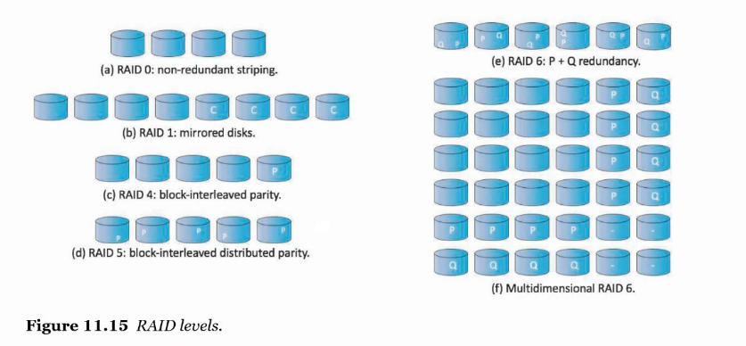
    - RAID 0: 데이터를 여러 디스크에 분할 저장, 한 디스크에서 장애 발생 시 데이터가 모두 손실된다
    - RAID 1: 디스크에 기록된 정보를 모두 mirroring하여 저장
    - RAID 4: parity disk를 추가, 디스크 에러를 감지
    - RAID 5: 각 디스크에 parity bit 추가
    - RAID 6: 각 디스크에 parity bit를 이중으로 추가하여 더 정교하게 에러 감지
    - Multidimensional RAID 6: 드라이브를 2차원 이상의 배열로 정렬하고, 수평/수직으로 RAID level 6를 구현
    - 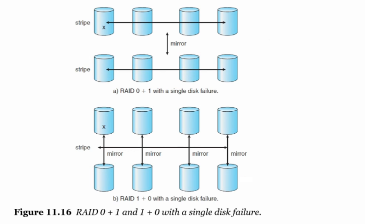
    - RAID 0 + 1: striping한 디스크를 mirroring하는 방식, mirroring 전에 한 디스크가 고장나면 데이터가 손실될 위험이 있다
    - RID 1 + 0: mirroring한 디스크를 striping하는 방식, RAID 0+1보다 안정성이 높아 현업에서 주로 사용

 

# I/O Systems

▪ Two main jobs of a computer: I/O and computing
- main job은 I/O
- I/O에서의 OS(운영체제)의 역할은 I/O operation(동작) 및 I/O devices(장치)를 관리하고 제어하는 것
- 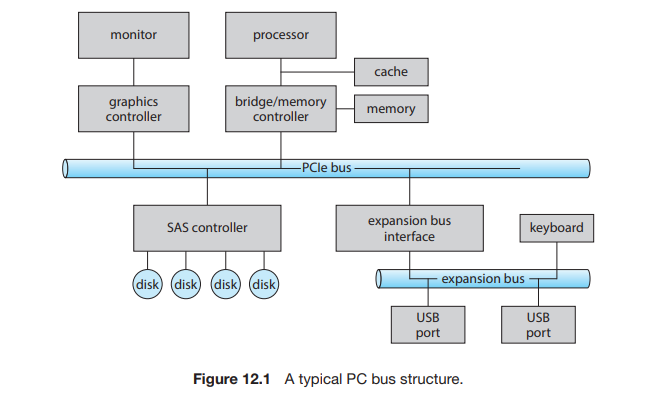
    - 모든 PC 아키텍처 중심에는 bus가 있다
    - bus에 controller들이 달려 있다
    - I/O device controller를 가지고 bus를 통해서 CPU가 디바이스들에게 명령을 내리는데, 그걸 OS가 관장한다

 

▪ Memory-Mapped I/O
- input/output을 하려면 CPU가 디바이스에 명령을 내려야 하는데
- 프로세서는 I/O 전송을 위해 컨트롤러에 명령과 데이터를 어떻게 주는가
- 각 레지스터의 번지수를 알아내서 명령한다
- 각 I/O controller는 CPU로부터 받은 명령/데이터를 저장하는 레지스터를 가지고 있고, 이 레지스터들을 메모리에 mapping한다
- 이로써 메모리 주소로 레지스터 값을 읽고 쓸 수 있다, 즉 레지스터에 메모리 주소를 부여하는 것이다
- 컨트롤러에는 데이터 및 제어 신호를 위한 하나 이상의 레지스터가 있다
    - data-in register
    - data-out register
    - status register
    - control register

**▪ Three types of I/O**
1. **polling** (or busy-wating)
    - busy bit가 종료될 때까지 반복해서 status register를 읽는다
2. **interrupt**
    - 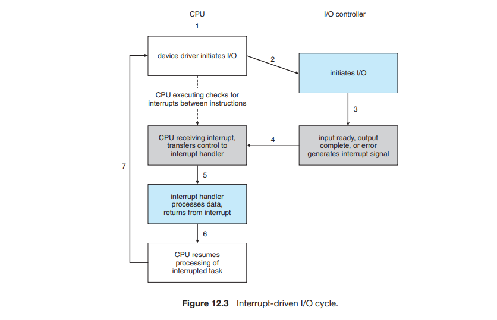
    - CPU는 interrupt-request line이라고 하는 하드웨어 전선(wire)이 있다
    - CPU에서 인터럽트를 감지하면 ISR(interrupt service routine)로 보내 인터럽트를 관리하게 한다
    - ISR 주소는 interrupt vector table에 보관된다
3. **DMA**
    - 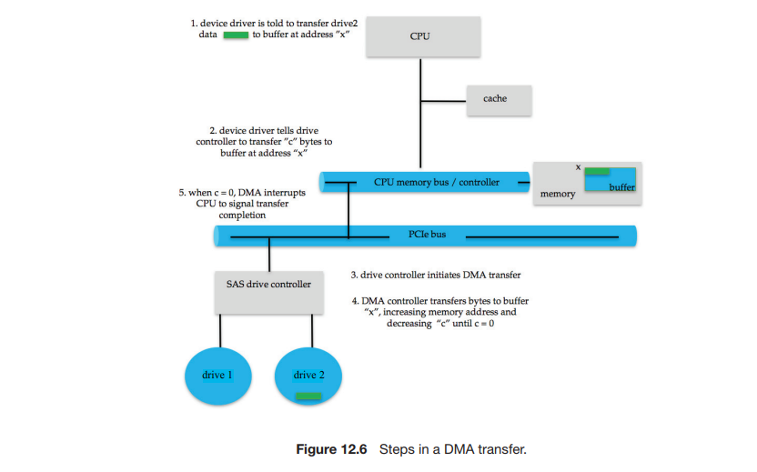
    - Direct Memory Access
    - 레지스터를 통해 I/O하지 않고, 컨트롤러에서 직접 I/O 작업을 처리
    - 대용량 데이터 전달에 적합

 

**▪ Blocking I/O .vs. Non-blocking I/O**
- Blocking I/O
    - 스레드가 중단된다(suspended)
    - running queue에서 waiting queue로 이동
    - 호출된 함수가 작업이 완료될 때까지 blocking
- Non-blocking I/O
    - 스레드 실행을 중단(halt)하지 않는다
    - 기다리지 않고, 결과가 있든 없든(data가 available하든 안하든) 그 값을 바로 리턴
        - 이 과정을 입력 데이터가 있을 때까지 반복
    - 호출된 다른 함수가 작업을 수행할 수 있다(non-blocking)
- Asynchronous system call
    - 스레드는 작업 요청 후 코드를 계속 실행한다
    - 전체 작업이 완료되었을 때의 callback을 요청한다
- 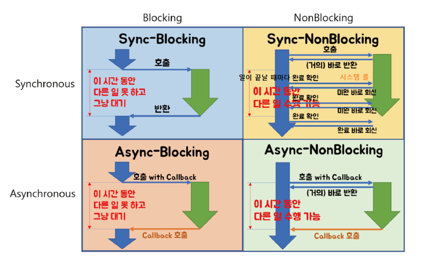

 

# File System

**▪ File System**
- 데이터와 프로그램에 대한 저장 및 엑세스 메커니즘을 제공
- file system의 구성
    - file: stores related data
    - directory: organizes all the files in the system

 

▪ File Access Method
1. sequential access
    - 파일 내 정보를 순서대로 접근
    - 파일의 레코드가 순차적으로 기록되어있어 판독할 때도 순차적으로 판독한다
2. direct access
    - relative access
    - 파일 내에서 원하는 레코드로 바로 진입해, 그 위치에서부터 파일을 읽는다
- 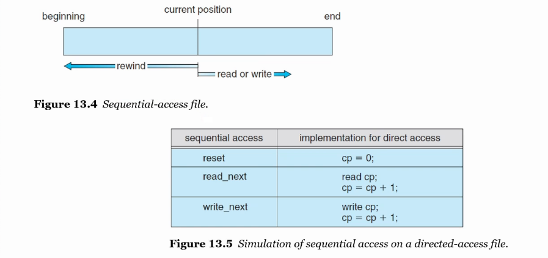

 

▪ Directory Structure
- file name을 file control block으로 변환하는 symbol table
- 디렉토리 구조 구성 방식
    - Single-Level Directory
        - 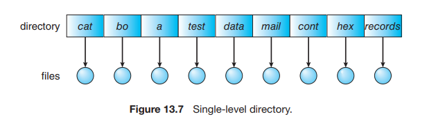
    - Two-Level Directory
        - 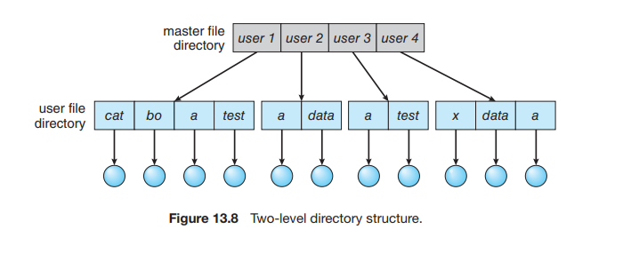
    - Tree-Structured Directories
        - 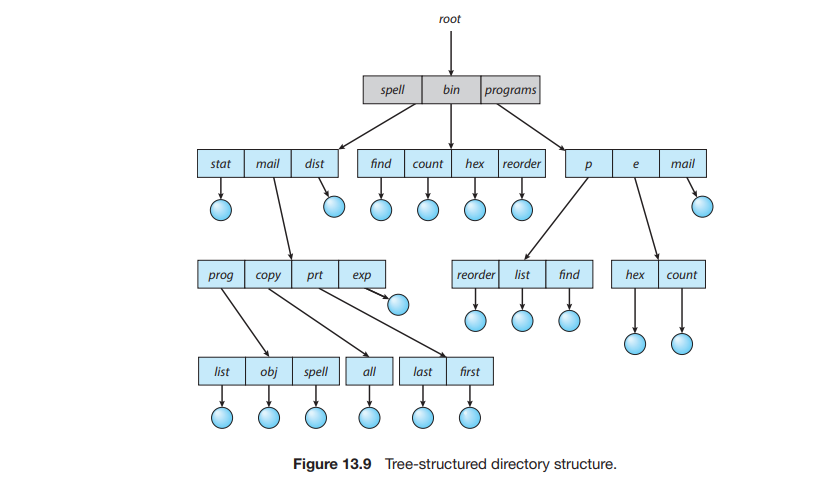
    - Acyclic-Graph Directories
        - 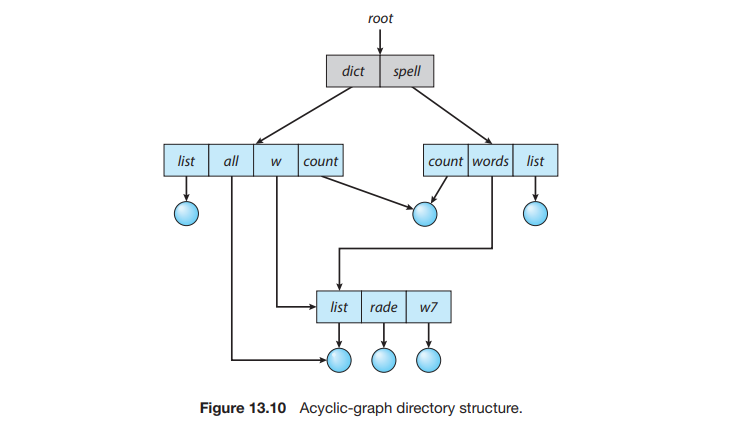
    - General-Graph Directory
        - 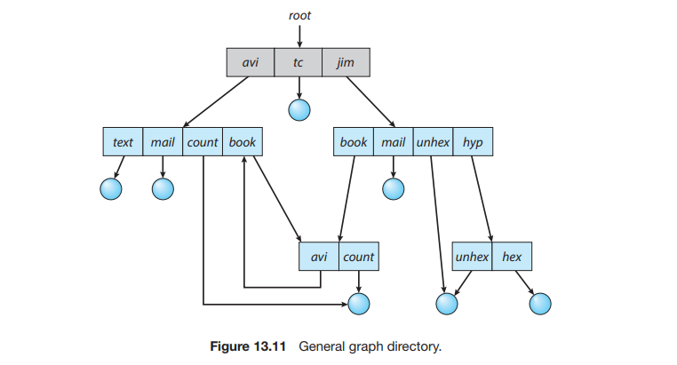

 

# File-System Implementation

▪ File-System Structure
- 파일 시스템 자체도 다양한 레벨로 구성
- 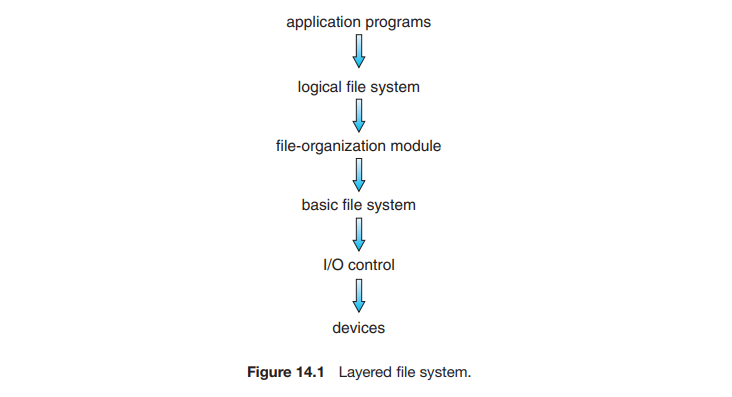

 

**▪ Allocation Method**
- 파일 시스템 구현에서의 주요 문제
    - **file에 공간을 어떻게 할당해서** 저장 공간을 효율적으로 활용하고 file access를 빠르게 할까
- Three major methods in wise use
    - `Contiguous Allocation`
        - 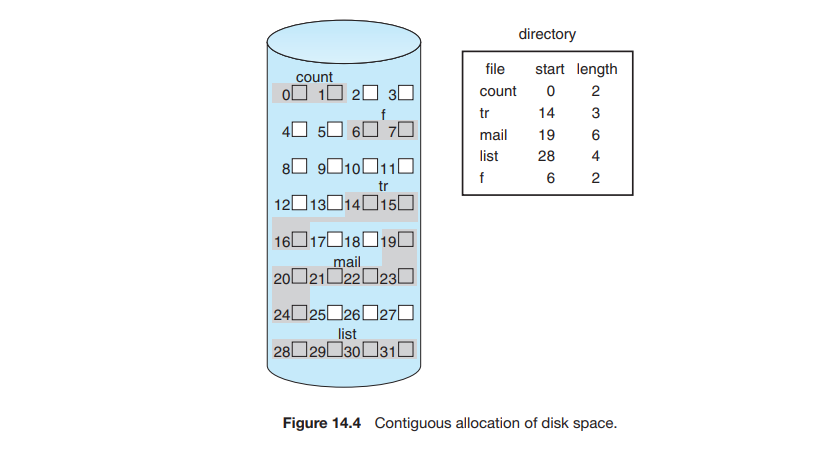
        - 각 파일이 디바이스의 연속 블록 집합을 차지하도록 한다
        - 문제점: external fragmentation, need for compaction(압축)
    - `Linked Allocation`
        - 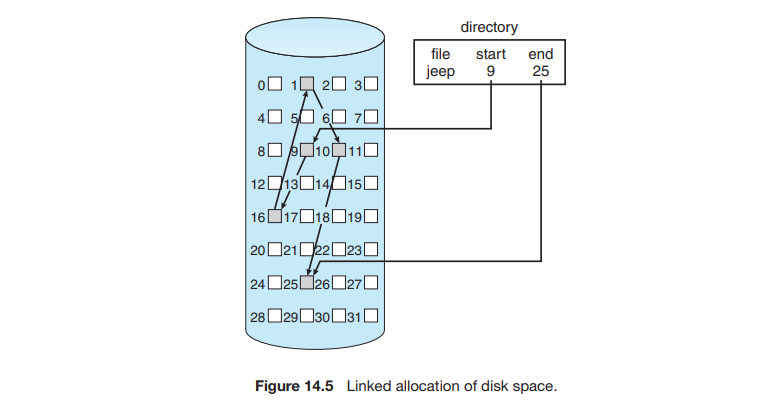
        - contiguous allocation의 모든 문제점을 해결
        - 각 파일은 저장 블록의 linked list이다
        - 블록은 장치의 어느 곳이든 흩어져 있을 수 있다
        - sequential-access file에서만 효과적이다
        - 단점
            - sequential-access file에서만 효과적이다 (i번째 파일 블록을 찾기 위해서는 파일 처음부터 시작해야 하기 때문)
            - 포인터에 필요한 공간
        - File Allocation Table
            - 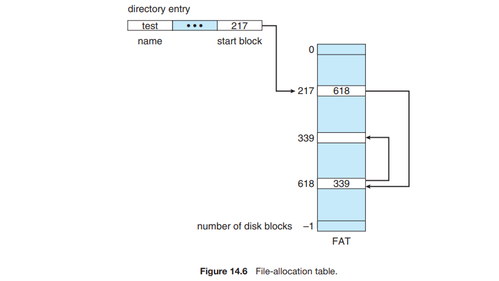
            - Linked Allocation의 변형으로, 하나의 데이터 블록에 다음 블록에 대한 정보를 담고 있는 테이블이다
    - `Indexed Allocation`
        - 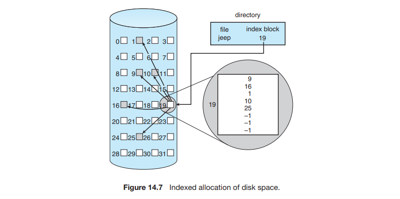
        - linked allocation의 문제점: 블록에 대한 포인터가 블록으로 흩어져있다
        - index allocation은 모든 포인터들을 **index block**에 담는다
        - 각 파일은 각 index block을 가진다
        - index block: an array of storage-block addresses
        - index block의 i번째 항목은 파일의 i번째 블록을 가리킨다

 

▪ Free-Space Management
- 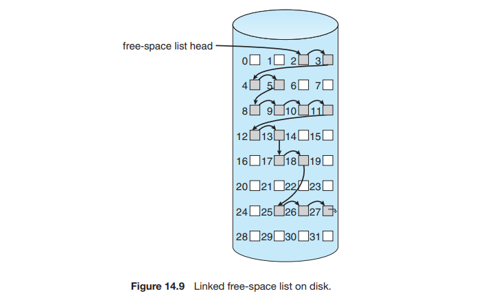
- free disk space를 추적하기 위해 시스템은 free-space list를 관리한다