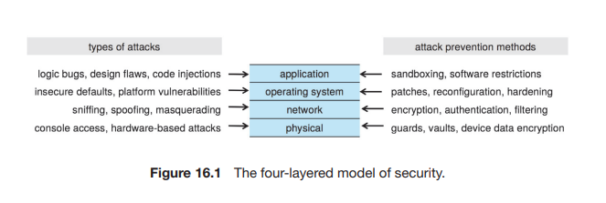
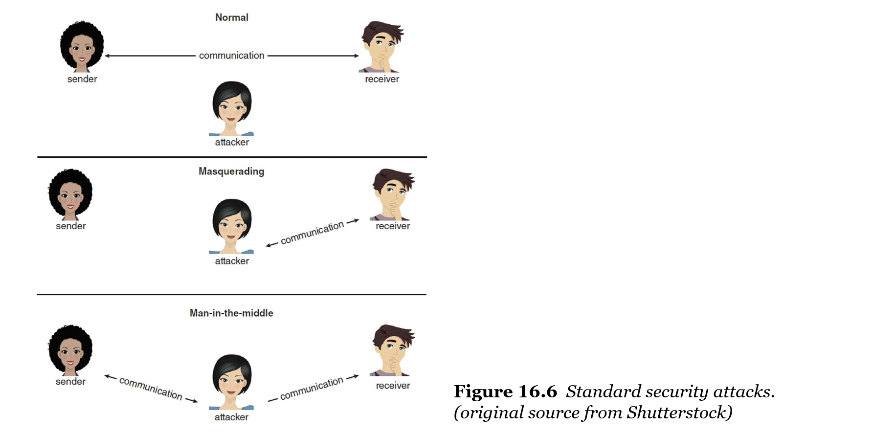
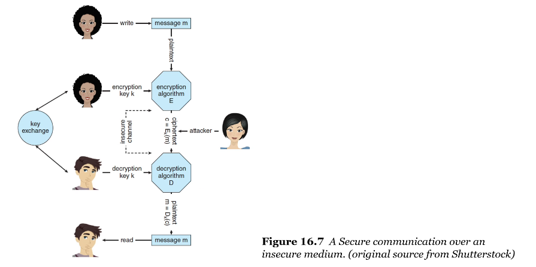
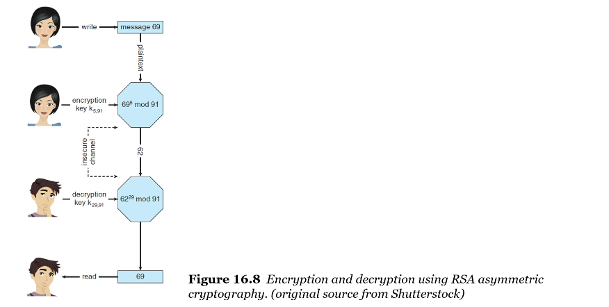
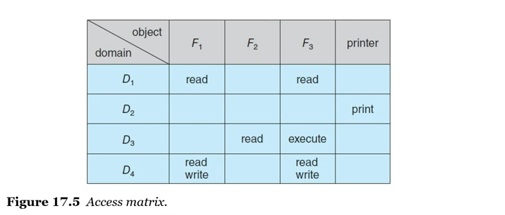

# Security and Protection

▪ Security
- 사용자 인증(authentication)을 보장
    - 시스템에 저장된 정보(data and code)와 컴퓨터 시스템의 물리적 리소스의 무결성(integrity)를 보호하기 위해
- unauthorized access(무단 엑세스), malicious destruction or alteration(악의적인 파괴/변경), and accidental introduction of inconsistency(우연한 불일치 도입)로부터 컴퓨터 자원을 보호하는 작업을 포함한다

▪ Protection
- 사용자에게 허용된 엑세스 유형을 제한하여 시스템에 대한 엑세스를 제어한다
- 운영체제에서 적절한 권한(authorization)을 얻은 프로세스만 메모리 세그먼트, CPU 및 기타 리소스에서 작동할 수 있도록 한다

▪ Computer resources
- 우연히 또는 고의로 misused될 수 있다
- 공격(attacks)을 방어하거나 탐지하는 메커니즘 필요
- **cryptography**(암호화)는 핵심 보안을 가능하게 하는 요소(enabler)이다

 

▪ Security Violations(위반)
- threat: 보안 위반 가능성(potential), accidental(우발적)
- attack: 보안을 파괴하려는 시도(attempt), intentional(의도적)
- 보안 위반의 유형
    - Breach of confidentiality (기밀성 위반)
    - Breach of integrity (무결성 위반)
    - Breach of availability (가용성 위반)
    - Theft of service (서비스 도용)
    - Denial of service (DoS서비스 거부): Distributed Dos(DDos)

 

▪ Four Levels of Security
- Physical: 침입자(intruders)의 진입에 대해 물리적으로 보호되어야 한다
- Network: 네트워킹은 보안 측면에서 유해하다(시스템 무단 엑세스에 대한 잠재적 벡터를 제공)
- Operating System: 공격 표면을 줄이고 침투를 방지해야 한다
- Application: 무해한(benign) 프로그램에도 보안 버그가 포함될 수 있다
- 

 

▪ Security Holes(보안 허점) in Programs (or Processes)
- Malware
    - 맬웨어는 컴퓨터 시스템을 악용, 비활성화 또는 손상시키도록 설계된 소프트웨어
    - Trojan horse, spyware, ransomware, backdoor, or logic bomb
- Code Injection
    - 대부분의 소프트웨어는 악성(malicious)이 아니지만 코드 인젝션 공격으로 인해 심각한 위협이 된다
- Viruses and Worms
    - 바이러스
        - 합법적인 프로그램에 포함된 코드 조각
        - 자가 복제(self-replicating)가 가능하며 다른 프로그램을 감염시키도록 설계되었다
    - 웜은 네트워크를 사용하여 인간의 도움 없이 복제한다

 

▪ Threats in the System and the Network
- Attacks via Network Traffic
    - sniffing: 공격자는 수동적인 상태로(remain passive) 네트워크 트래픽을 가로챈다
    - spoofing: 당사자 중 하나로 가장하거나(masquerading) 완전히 활동적인 중간자(person-in-the-middle)가 되어 두 peer 간의 거래를 가로채거나 수정할 수 있다
- Denial of Service
    - 정보를 얻거나 리소스를 훔치는 것이 목적이 아니라 시스템이나 시설의 정당한(legitimate) 사용을 방해하는 것
- Port Scanning
    - 그 자체가 공격이 아니라 *취약점(vulnerability)을 탐지*하기 위한 수단
    - 사용 중인 OS 유형을 추론하기 위한 지문(fingerprinting)의 일부인 경우가 많다
- 

 

▪ Cryptography
- 암호화의 역할: OS가 네트워크를 신뢰할 필요가 없도록 하는 것
- key를 기반으로 네트워크 상의 컴퓨터에 선택적으로 배포된다
- 메시지를 처리(encrypt or decrypt)하는 데 사용된다

▪ Encryption
- 암호화를 통해 sender가 key를 소유한 receiver만 메시지를 읽을 수 있도록 한다
- 암호문(ciphertexts)에서 key를 도출(derive)하는 것이 불가능(infeasible)하다는 것이 중요하다

▪ Two main types of encryption algorithms (암호화 알고리즘의 두 종류)
- Symmetric Encryption (대칭 암호화)
    - 동일한 키가 암호화 및 복호화에 사용된다
    - 따라서 key 암호는 보호되어야 한다
    - key 교환은 두 당사자 간에 직접 또는 신뢰할 수 있는 제 3자(인증기관)을 통해 이루어진다
    - 일반적으로 사용되는 대칭 알고리즘
        - DES: Data Encryption Standard
        - AES: Advanced Encryption Standard
    - 
- Asymmetric Encryption (비대칭 암호화)
    - 암호화와 복호화 키가 다르다
    - 공개 키(public key), 개인 키(private key)
    - 예시) 은행에서 나의 계좌번호(public key)와 비밀번호(private key)
    - a breakthrough in cryptography, described by Diffie and Hellman
    - 누구든지 수신 엔티티에 대한 메시지를 암호화할 수 있으며, 누가 수신중인지에 관계없이 해당 엔티티만이 메시지를 해독할 수 있다
    - 비대칭 암호화 알고리즘
        - RSA algorithm: Rivest, Shamir, and Adleman
    - 

 

▪ Authentication (인증)
- encryption(암호화)는 가능한 메시지 *수신자(receivers)* 집합을 제한하는 방법을 제공한다
- 반면 인증은 가능한 메시지 *발신자(senders)* 집합을 제한하는 방법을 제공한다
- 인증은 메시지가 수정되지 않았음을 제공하는 데에도 유용하다
- hash function을 통한 보안
    - 해시 함수는 메시지에서 message digest(or hash value)로 불리는 작은 고정 크기 데이터 블록을 생성한다
    - fixed-sized block of data: SHA-256
- 복호화 불가(따라서 암호화가 아님), verification(참/거짓 검증)만 가능
- Two types of authentication algorithm (인증 알고리즘의 두 종류)
    - MAC: Message-Authentication Code
        - 비밀 키를 사용하여 cryptographic(암호화) checksum 생성
    - *Digital Signature Algorithm*
        - 누구든지 메시지의 진위를 확인할 수 있도록 하는 전자 서명을 생성
        - 공개 키에서 개인 키를 도출하는 것이 계산상 불가능하므로 매우 유용한 방식(the BitCoin on the BlockChain)

 

▪ Protection
- 컴퓨터 시스템에서 정의한 리소스에 대한 프로세스 및 사용자의 (승인된, authorized) 엑세스를 제어한다
- 공유 리소스를 사용하고 인터넷과 같은 안전하지 않은 통신 플랫폼에 연결된 복잡한 시스템의 안정성을 높인다

 

▪ The Principle of Least Privilege (최소 권한의 원칙)
- protection의 핵심 원칙
- 프로세스, 사용자, 시스템에 작업을 수행하기에 충분한 권한이 부여되어야 한다
- UNIX 사용자&파일 권한(privileges): root, sudo, chmod
- permissions(권한): 악의적인(malicious) 공격을 완화(mitigate)할 수 있는 기회를 제공한다

 

## Protection Methods

▪ Access Matrix
- protection의 일반적인 모델(도구)
- ACL을 만든다
    - ACL: Access Control List
    - 누가 어디까지 접근할 수 있는지 리스트를 만들어서 권한을 체크한다
    - 매트릭스의 각 항목은 엑세스 권한 집합으로 구성
    - 행(rows): 도메인, 열(columns): 객체(objects)
    - 어떤 도메인의 어떤 object에 부여할 권한을 표시
- 다양한 policy를 지정하는 메커니즘을 제공
- 

 

▪ Sandboxing
- 프로세스를 수행할 수 있는 작업 환경 내에서 실행시킨다
- 외부로부터 들어온 프로그램이 보호된 영역에서 동작하도록 한다
- 프로세스는 credentials(자격 증명)으로 실행되며, 사용자가 엑세스할 수 있는 모든 항목에 엑세스 권한이 있다
- credential이 있는 행위만 허용된다
- ex) Java & .NET - virtual machines , Android - mandatory access control

▪ Code Signing
- 프로그램 및 실행 파일의 디지털 서명(digital signing)
- 프로그램이 생성된 이후 코드가 변경되지 않았음을 보장한다
- 운영체제 배포, patches 및 3rd party 도구, 모바일 앱에 사용된다

 

## The End

▪ The Last Question
- 새로운 운영체제를 개발할 필요가 있을까
    - OS는 computer system을 operation해주는 시스템
    - computer system: 정보(information)를 처리하는 장치, 폰노이만 구조
1. Quantum Computers
    - Quantum Information(양자 정보)을 처리
    - 정보 처리 방식이 완전히 다름
    - process 개념이 없음, quantum computer를 제어할 수 있는 o/s는? - 연구중
    - 정보 처리 최소 단위가 bit가 아닌 qubit(quantum bit)
    - 양자 현상 - 중첩 상태, 얽힘
    - classical computer의 RSA 암호화 방식을 박살낼 수 있다
    - Shor's algorithm
2. World Computers
    - by Vitalik Buterin
    - Block-Chain에서 실행되는 Ethereum platform
    - 컴퓨터를 더이상 하나의 실체를 가진 장치로 생각할 필요가 없다
    - 블록체인은 전 세계의 수많은 peer-to-peer 네트워크가 연결되어 있는 거대한 컴퓨터이다
    - 그 안에는 수많은 CPU, memory가 있으므로 그 위에 Dapp(Decentralized app)을 올리자
    - Dapp을 하나의 process로 보면, 거대한 p2p network computer(world computer)에서 Dapp의 load, execute, synchronize를 관리하는 거대한 OS가 Ethereum platform이다
- 운영체제에서 다룬 주제들이 새로운 환경에서 새롭게 또 발생할 것이다