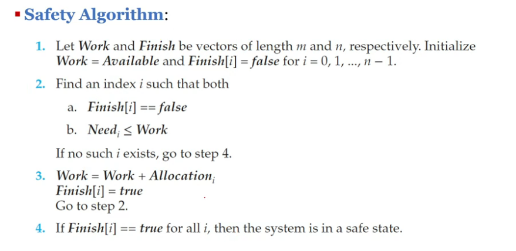
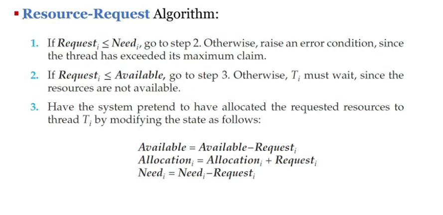
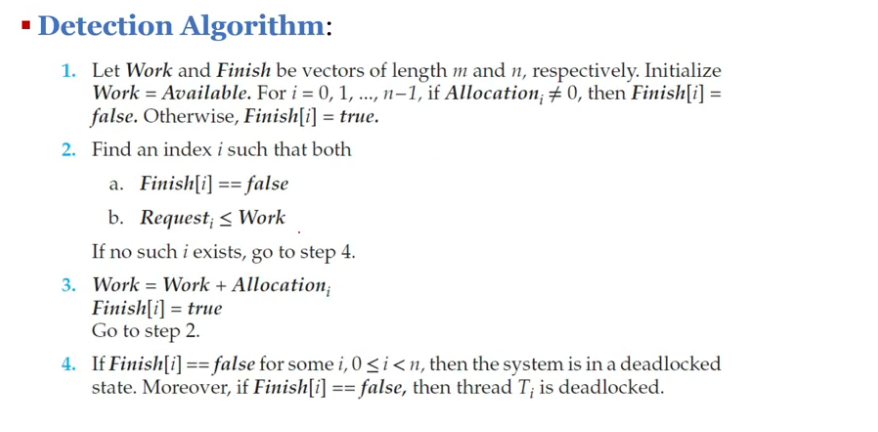

# Deadlock

▪ deadlock
- 프로세스 집합에 있는 각 프로세스가, 모두 같은 집합에 있는 다른 프로세스만이 일으킬 수 있는 이벤트를 기다리고 있는 상황
- waiting thread(or process)는 다시는 상태를 바꿀 수 없는 상황
    - 스레드가 요청한 resource가 다른 대기중인 스레드에 점유되고 있기 때문

▪ System
- 다수의 competing threads 사이에 분배될 한정된 수의 resource로 구성
- 리소스 유형은 몇 가지 동일한 인스턴스로 구성 (예: CPU 주기, 파일 및 I/O 장치)
- 스레드가 resource type의 인스턴스를 요청하면 모든 인스턴스 할당이 요청을 충족해야 한다
- 스레드의 리소스 활용  
  Request(요청) - Use(사용) - Release(해제)  
  Use 상태가 critical section, 인스턴스가 여러 개이기 때문에 critical section 안에 여러 resource가 들어갈 수 있다.

> 프로세스가 자원을 얻지 못해서 다음 처리를 하지 못하는 상태  
>'교착 상태'라고도 부름  
> 시스템적으로 한정된 자원을 여러 곳에서 사용하려고 할 때 발생

 

▪ deadlock 발생 조건  
4가지를 모두 만족해야 함
1. Mutual Exclusion (상호 배제)  
`-` 적어도 한 리소스가 non-sharable하다 
2. Hold and Wait (점유 대기)  
`-` 어떤 스레드가 적어도 한 리소스를 hold한 다음에 waiting한다  
3. No preemption (비선점)  
`-` 자원(CPU, file, printer, ...)이 선점이 불가하다  
4. Circular Wait (순환 대기)  
`-` 프로세스의 집합에서 순환 형태로 자원을 대기한다  

 

▪ Resource-Allocation Graph (RAG, 자원 할당 그래프)
- deadlock을 정확하게(precisely) 설명하기 위한 방향성(directed) 그래프
- G = (V, E)
    - V 집합의 두 타입 노드
        - T = active thread의 집합
        - R = resource type의 집합
- directed edge: T -> R (request edge)
    - 스레드 T가 인스턴스 R을 요청했다
- directed edge: R -> T (assignment edge)
    - 인스턴스 R이 스레드 T를 할당되었다
- 그래프에 cycle이 없으면
    - no deadlock
- cycle이 있으면
    - deadlock이 있을 수도, 없을 수도

 

▪ Deadlock 문제 해결 방법
1. Ignore  
`-` 시스템에 데드락이 발생하지 않을 거라 기도한다
2. prevent or avoid  
`-` 시스템이 절대 deadlock state에 들어가지 않도록 한다.  
`-` Deadlock Prevention - 불가능 or 아주 어렵거나 값비쌈  
`-` Deadlock Avoidance - Banker's Algorithm (좀 비쌈)
3. Allow, then detect and recover   
`-` Deadlock Detection  
`-` Recovery from Deadlock

▪ Deadlock Prevention
- deadlock의 4가지 조건 중 적어도 한 개의 condition만 발생하지 않도록 막는다
1. Mutual Exclusion
    - mutex lock과 같은 몇몇 resources는 본질적으로(intrinsically) non-sharable하다
    - 대부분의 상황에 적용할 수 없으므로 pass
2. Hold and Wait
    - 스레드가 리소스를 요청할 때, 어떤 리소스도 hold하고 있지 않는다(다 내려놓고 요청)
    - 대부분의 application에 비실용적임(impractical)
3. No preemption
    - preemption(선점)될 수 있는 프로토콜을 사용하자
    - 스레드는 regain할 수 있을 때 restart된다
    - 강제로 선점될 경우 문제 발생할 수 있으므로 실질적으로 사용 x
4. Circular Wait
    - 때때로 practical
    - 자원 타입들에 순서를 부여해준다(Impose a total ordering)
    - require할 때, 내가 점유하고 있는 리소스보다 더 높은 번호만 요청
        - require resources in an increasing order
    - 순환 대기 상태가 이루어질 수 없다는 것이 증명가능하다(provable)
    - deadlock 문제는 해결하지만, starvation 문제는 여전함
    - 하지만, lock ordering이 deadlock prevention을 보장하지는 않는다
        - 만약 lock을 동적으로 획득할 수 있는 경우
        - transaction() function
- Demerits
    - low device utilization and reduced system throughput
    - 다 잘 안되니까 avoid하자

 

# Deadlock Avoidance and Banker's Algorithm

▪ Deadlock Avoidance
- 프로세스의 동작 순서를 정해서 circular wait를 만들지 않는다.
- request가 왔을 때, 요청을 받아주기 전에, possible future deadlock을 피하기 위해 wait한다
- 추가 정보 필요
    - resource가 어떻게 요청되는지
- 기본 idea: deadlocked state에 절대 들어가지 않도록 알고리즘 설계
- 알고리즘 핵심: safe sequence를 찾는다
- safe state
    - not a deadlocked state
    - 시스템이 각 스레드(최대값까지)에 리소스를 순서대로 할당할 수 있고 deadlock을 피할 수 있는 경우
    - safe sequence(a sequence of threads)가 존재하는 경우
- avoidance algorithm
    - safe state의 concept으로 알고리즘 정의
    - 시스템이 절대 deadlocked state에 진입하지 않도록 보장한다
    - 즉, 시스템이 항상 safe state에 있도록 한다
    - 시스템 초기 상태는 safe state, 이후 모든 request에 대해 자원을 할당할지 결정
    - single instance
        - Resource-Allocation Graph
        - claim edge
            - 앞으로 자원을 요청할 스레드
        - cycle-detection algorithm in a directed graph
            - no cycle -> grant. safe state
            - cycle -> no grant. unsafe state
    - multiple instances
        - **Banker's Algorithm**
            - RAG보다 비효율적이고 복잡함
            - 스레드(프로세스)와 자원을 matrix 형태로 표현
            - Data Structures
                - Available: 리소스 종류별 할당 가능한 수
                - Max: 스레드가 최대로 요청할 리소스 양
                - Allocation: 최근 할당된 리소스 수
                - Need: 남은(앞으로 요청할) 리소스
            - 두 가지 알고리즘으로 합쳐져 있다
            - Safety Algorithm
                - 
            - Resource-Request Algorithm
                - 

 

# Deadlock Detection and Recovery

▪ Deadlock Detection
- prevent는 아예 쓸모없고, avoid는 너무 복잡하고 부담스럽다
- deadlock이 발생했는지 검사하는 알고리즘. deadlock에 빠졌으면 recover한다
- single instance
    - wait-for graph
        - resource-allocation graph에서 리소스를 뺀 dependency graph
        - 그래프에서 cycle detection
- several instances
    - deadlock detection algorithm
        - banker's algorithm의 data structure를 변형
        - Available[m]
        - Allocation[n x m]
        - Request[n x m]: 스레드의 current request
        - 초기화할 때 Allocation이 0일 경우, 자원을 안 갖고 있으니 deadlock 일으킬 일이 없으므로 Finish[i]=true
        - banker's에서는 전부 Finish[i]가 true가 되어야 하지만, 이건 detection이므로 false인 스레드들이 deadlock 걸렸다고 판단
        - 

▪ Deadlock Recovery
- inform the operator
- recover
    - Process and Thread Termination
        - deadlocked process들을 모두 중단(abort)한다
        - deadlock cycle이 제거될 때까지 한 번에 한 프로세스만 중단한다
    - Resource Preemption
        - Selecting a victim: 비용을 최소화하는 선점 순서를 고려
        - Rollback: 프로세스를 safe state로 롤백하고 재시작
        - Starvation: 매번 victim에 선정되는 스레드 때문에 기아 현상이 발생할 수 있으므로 victim 선택 횟수 제한